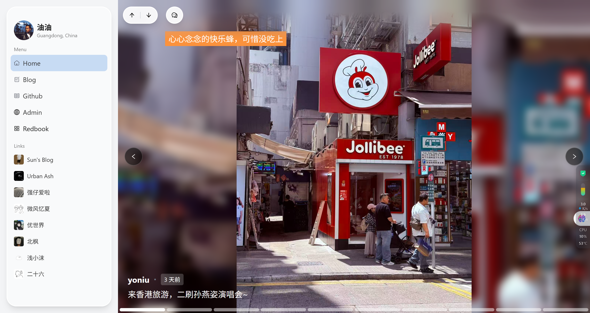

# Yoniu Moment（开发中）

一个用于发布日常瞬间的微博系统，随时随地掌握瞬间。

前端基于 NextJS(SSG) / React / TypeScript / Ant Design / Axios / ahooks / TailwindCSS 开发。

后端基于 NestJS / TypeScript / TypeORM 开发。

后端仓库（开发中，未开放）：<https://gitee.com/yoniu/homepage-api>



## 特性

- 移动端支持，随时随地发布 Moment📱💻
- 多种展示方式：Image Item、Text Item
- 每一条 Moment 可以搭配一条音乐，切换 moment 自动播放
- Moment 详情页（信息流可能导致过往日期太久的 moment 无人问津）
- Image Item 图片自动轮播，搭配背景音乐，米米的
- Text Item 支持插入图片多宫格、支持标题显示、Markdown 保存（想换系统顺手的事）、支持背景颜色 / 文字颜色设置
- Video Item 支持视频发布
- 支持 Meting 获取音乐详情（获取的音乐 url 暂时不支持播放）
- 支持文件上传（backblaze: 基于 AWS S3，意思是只要是 AWS S3 类的对象存储都可以）
- 支持友链设置（静态渲染，每次修改友链请**重新构建部署**，对友链双方 SEO 友好）
- 适配 HashNode 获取最新文章
- 适配 Twikoo 评论系统
- 适配 51la v6 网站统计
- 适配百度地图定位

## Todo

- 背景音乐曲库（保存当前使用，下次不用重新添加，直接从曲库里面找。也可以到曲库页面添加。）
- Live Photo Item 支持 Live Photo 发布（web 端无法上传 live photo，后续可能会出 APP，安卓妹别想了）
- 除了 Text Item 其他 Item 支持添加~~浮动文字 (已完成)~~、贴纸
- 加入 AI 支持（可能是根据 moment 内容自动生成背景音乐？）
- ...

## 使用指南

请保证 Node.js 版本 >= 18.18。后端需要运行环境，不是纯静态项目。

推荐宝塔一把梭，也可以使用 Cloudflare Pages 前端，宝塔做后端。

环境变量（没有设置环境变量的东西就在开发目录下面加一个 `.env` 文件）：

```
NEXT_PUBLIC_HOMEPAGE_API=<后端连接>
NEXT_PUBLIC_TWIKOO_ENVID=<Twikoo连接>
NEXT_PUBLIC_V6_ID=<51LA V6 ID>
NEXT_PUBLIC_V6_CK=<51LA V6 CK>
```

安装项目（没 pnpm 也可以使用 npm，最好是 pnpm）:

```bash
pnpm install
```

启动开发模式:

```bash
pnpm dev
```

启动生产方式:

> 生产方式就是打包成静态文件，会在 `./dist` 目录下生成可运行的静态文件。

```bash
pnpm build
```
